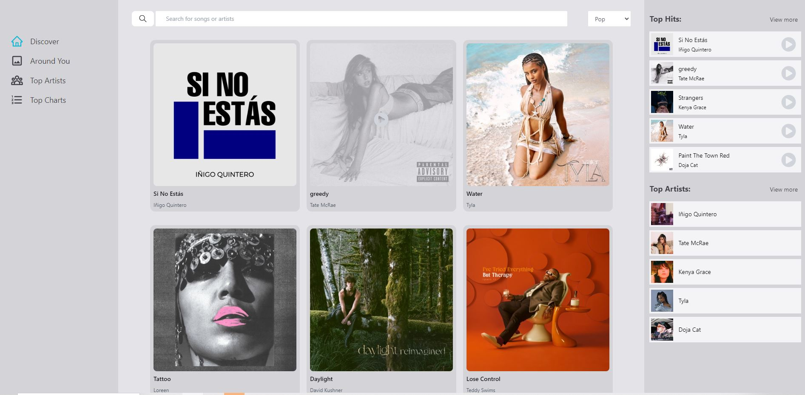

# Music Player

A lightweight and customizable music player that allows you to enjoy your favorite tunes with ease.
It is a comprehensive web and mobile application developed using React, Tailwind CSS, RapidAPI, and Redux Toolkit.

## Features

- **Music Player**: Allows users basic functionality to control the music including play, pause, skip, and shuffle features.
- **Advanced Search**: Search the song title, artist name, or by genre to see the curated results.
- **Popular Music Near You**: Displays popular artists and songs based on the user's geographical location.
- **WorldWide Top Charts**: Shows users the most popular artists and songs in the world.

For more information, visit the [official website](https://zsmusicplayer.online/).

